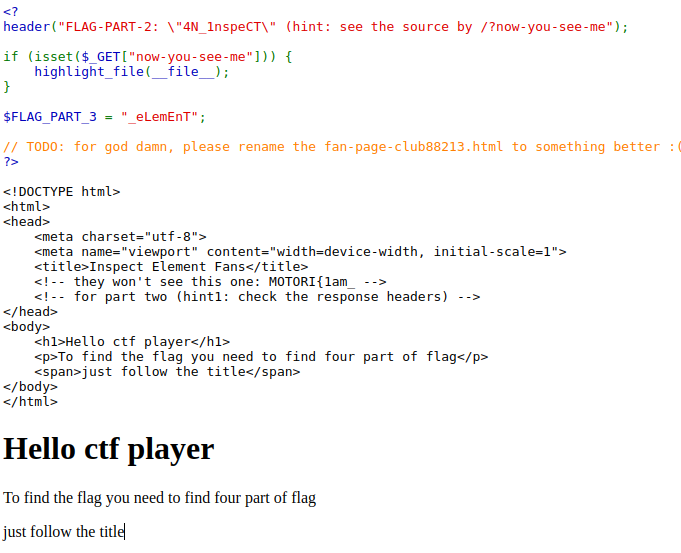
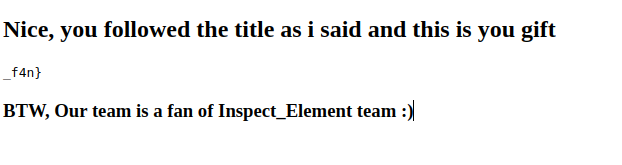

# Write up for inspect-element challenge

## Solve

### Step one
```sh
$ curl http://localhost:1337
<!DOCTYPE html>
<html>
<head>
	<meta charset="utf-8">
	<meta name="viewport" content="width=device-width, initial-scale=1">
	<title>Inspect Element Fans</title>
	<!-- they won't see this one: MOTORI{1am_ -->
	<!-- for part two (hint1: check the response headers) -->
</head>
<body>
	<h1>Hello ctf player</h1>
	<p>To find the flag you need to find four part of flag</p>
	<span>just follow the title</span>
</body>
</html>
```
>flag: `MOTORI{1am_`

### Step two
```sh
$ curl http://localhost:1337 -I # -I returns only http response headers
HTTP/1.1 200 OK
Date: Sun, 09 Jun 2024 14:46:53 GMT
Server: Apache/2.4.56 (Debian)
X-Powered-By: PHP/8.0.30
FLAG-PART-2: "4N_1nspeCT" (hint: see the source by /?now-you-see-me
Content-Type: text/html; charset=UTF-8
```
>flag: `MOTORI{1am_4N_1nspeCT`

### Step three
open `http://localhost:1337/?no-you-see-me` in your browser

<div align="center">



</div>

>flag: `MOTORI{1am_4N_1nspeCT_eLemEnT`

### Step four
open `http://localhost:1337/fan-page-club88213.html` in your browser

<div align="center">



</div>

>flag: `MOTORI{1am_4N_1nspeCT_eLemEnT_f4n}`